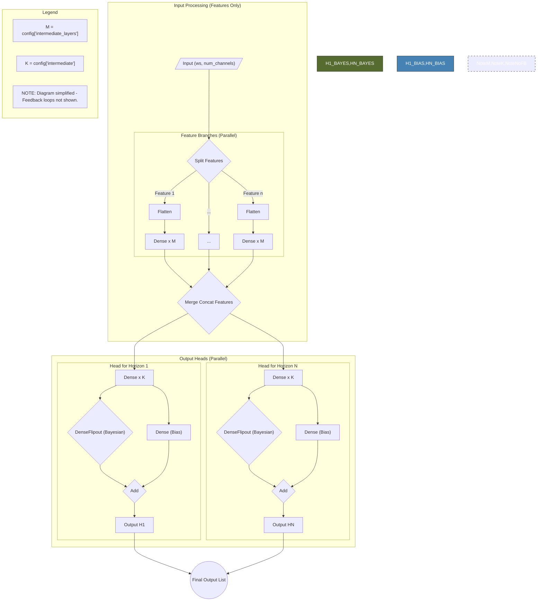

# Prediction Provider

## Description

The Prediction Provider is a comprehensive, plugin-based system for financial time series prediction. It provides a RESTful API for asynchronous prediction requests with complete audit trails for billing and compliance. The system is designed following Test-Driven Development (TDD) principles with extensive behavioral testing coverage.

## Current Status

**Development Status**: Core functionality complete, authentication and production features under development

### Test Coverage: 110 Tests (84% Pass Rate)
- ✅ **Unit Tests**: 32 tests (31 passing, 1 failing) - 96% pass rate
- ✅ **Integration Tests**: 19 tests (100% pass rate)
- ✅ **System Tests**: 7 tests (100% pass rate)
- ✅ **Acceptance Tests**: 13 tests (100% pass rate)
- ⚠️ **Security Tests**: 8 tests (62% pass rate - 5 passing, 3 failing)
- 🔴 **Production Tests**: 17 tests (24% pass rate - 4 passing, 13 failing)

### What's Working
- ✅ Asynchronous prediction processing
- ✅ Plugin-based architecture (feeder, predictor, pipeline, core, endpoints)
- ✅ Database operations and data persistence
- ✅ RESTful API endpoints for predictions
- ✅ Health monitoring and system status
- ✅ CORS support and basic security measures

### What's In Development
- ⚠️ Authentication enforcement and user management
- ⚠️ Input sanitization and security hardening
- ⚠️ Rate limiting and brute force protection
- ⚠️ Complete audit logging for compliance
- ⚠️ Production-ready security measures

## Architecture

The system follows a **plugin-based architecture** with five main plugin types:

1. **Feeder Plugins**: Obtain and prepare input data (e.g., financial data from APIs)
2. **Predictor Plugins**: Load models and generate predictions
3. **Pipeline Plugins**: Orchestrate the complete processing workflow
4. **Core Plugins**: Manage central server configuration and API framework
5. **Endpoints Plugins**: Define individual RESTful API endpoints

## Installation Instructions

To install and set up the Prediction Provider system, follow these steps:

1. **Clone the Repository**:
    ```bash
    git clone https://github.com/harveybc/prediction_provider.git
    cd prediction_provider
    ```

2. **Create and Activate a Virtual Environment**:
    ```bash
    # Using conda (recommended)
    conda create --name prediction_provider python=3.12
    conda activate prediction_provider
    
    # Or using venv
    python -m venv venv
    source venv/bin/activate  # On Windows: venv\Scripts\activate
    ```

3. **Install Dependencies**:
    ```bash
    pip install --upgrade pip
    pip install -r requirements.txt
    ```

4. **Initialize Database**:
    ```bash
    python init_db.py
    ```

5. **Build the Package**:
    ```bash
    python -m build
    ```

6. **Install the Package**:
    ```bash
    pip install .
    ```

## Usage

### Starting the Server

```bash
# Using the main module
python -m app.main

# Or using the console script (if installed)
prediction_provider

# With custom configuration
python -m app.main --config config/production_config.json
```

The server will start on `http://localhost:8000` by default.

### API Usage Examples

#### Health Check
```bash
curl http://localhost:8000/health
```

#### Create Prediction Request
```bash
curl -X POST "http://localhost:8000/api/v1/predictions/" \
  -H "Content-Type: application/json" \
  -d '{
    "symbol": "AAPL",
    "interval": "1d",
    "prediction_type": "short_term"
  }'
```

#### Check Prediction Status
```bash
curl http://localhost:8000/api/v1/predictions/123
```

#### List All Predictions
```bash
curl http://localhost:8000/api/v1/predictions/
```

### Running Tests

```bash
# Run all tests
python -m pytest tests/ -v

# Run specific test categories
python -m pytest tests/unit_tests/ -v
python -m pytest tests/integration_tests/ -v
python -m pytest tests/system_tests/ -v
python -m pytest tests/acceptance_tests/ -v

# Run tests with coverage
python -m pytest tests/ --cov=app --cov-report=html
```
        ```bash
        set_env.bat
        pytest
        ```

    - On Linux, run:
        ```bash
        sh ./set_env.sh
        pytest
        ```

9. **(Optional) Generate Documentation**:
    - Run the following command to generate code documentation in HTML format in the docs directory:
        ```bash
        pdoc --html -o docs app
        ```
10. **(Optional) Install Nvidia CUDA GPU support**:

Please read: [Readme - CUDA](https://github.com/harveybc/predictor/blob/master/README_CUDA.md)

## Usage

Example config json files are located in examples\config, for a list of individual parameters to call via CLI or in a config json file, use: **predictor.bat --help**

After executing the prediction pipeline, the predictor will generate 4 files:
- **output_file**: csv file, predictions for the selected time_horizon **(see defaults in app\config.py)**
- **results_file**: csv file, aggregated results for the configured number of iterations of the training with the selected number of training epochs 
- **loss_plot_file**: png image, the plot of error vs epoch for training and validation in the last iteration 
- **model_plot_file**: png image, the plot of the used Keras model
 
The application supports several command line arguments to control its behavior for example:

```
usage: predictor.bat --load_config examples\config\phase_1\phase_1_ann_6300_1h_config.json --epochs 100 --iterations 5
```

There are many examples of config files in the **examples\config directory**, also training data of EURUSD and othertimeseries in **examples\data** and the results of the example config files are set to be on **examples\results**, there are some scripts to automate running sequential predictions in **examples\scripts**.


### Directory Structure

```
predictor/
│
├── app/                                 # Main application package
│   ├── __init__.py                     # Package initialization
│   ├── cli.py                          # Command-line interface handling
│   ├── config.py                       # Default configuration values
│   ├── config_handler.py               # Configuration management
│   ├── config_merger.py                # Configuration merging logic
│   ├── data_handler.py                 # Data loading and saving functions
│   ├── data_processor.py               # Core data processing pipeline
│   ├── main.py                         # Application entry point
│   ├── plugin_loader.py                # Dynamic plugin loading system
│   ├── reconstruction.py               # Data reconstruction utilities
│   └── plugins/                        # Prediction plugins directory
│       ├── predictor_plugin_ann.py     # Artificial Neural Network plugin
│       ├── predictor_plugin_cnn.py     # Convolutional Neural Network plugin
│       ├── predictor_plugin_lstm.py    # Long Short-Term Memory plugin
│       └── predictor_plugin_transformer.py # Transformer model plugin
│
├── tests/                              # Test suite directory
│   ├── __init__.py                    # Test package initialization
│   ├── conftest.py                    # pytest configuration
│   ├── acceptance_tests/              # User acceptance tests
│   ├── integration_tests/             # Integration test modules
│   ├── system_tests/                  # System-wide test cases
│   └── unit_tests/                    # Unit test modules
│
├── examples/                           # Example files directory
│   ├── config/                         # Example configuration files
│   ├── data/                           # Example training data
│   ├── results/                        # Example output results
│   └── scripts/                        # Example execution scripts
│       └── run_phase_1.bat                 # Phase 1 execution script
│
├── concatenate_csv.py                  # CSV file manipulation utility
├── setup.py                           # Package installation script
├── predictor.bat                      # Windows execution script
├── predictor.sh                       # Linux execution script
├── set_env.bat                        # Windows environment setup
├── set_env.sh                         # Linux environment setup
├── requirements.txt                    # Python dependencies
├── LICENSE.txt                        # Project license
└── prompt.txt                         # Project documentation
```

## Example of plugin model:


### Test Strategy: Behavioral vs Implementation Testing

This project implements a dual testing strategy:

#### 🎯 **Behavioral Tests** (Recommended for CI/CD)
- **Location**: `tests/behavioral_tests/`
- **Focus**: User journeys and business outcomes
- **Stability**: High - resilient to implementation changes
- **Examples**: User onboarding, data isolation, access control

```bash
# Run behavioral tests (stable across code changes)
SKIP_BACKGROUND_TASKS=true SKIP_RATE_LIMITING=true python -m pytest tests/behavioral_tests/ -v
```

#### ⚙️ **Implementation Tests** (For detailed debugging)
- **Location**: `tests/production_tests/`, `tests/security_tests/`, etc.
- **Focus**: Specific API contracts and implementation details
- **Stability**: Lower - may need updates when implementation changes
- **Use Case**: Detailed debugging and implementation validation

```bash
# Run implementation tests (may need updates after code changes)
SKIP_BACKGROUND_TASKS=true SKIP_RATE_LIMITING=true python -m pytest tests/production_tests/ -v
```

See `BEHAVIORAL_TESTING_GUIDE.md` for detailed guidance on test design principles.